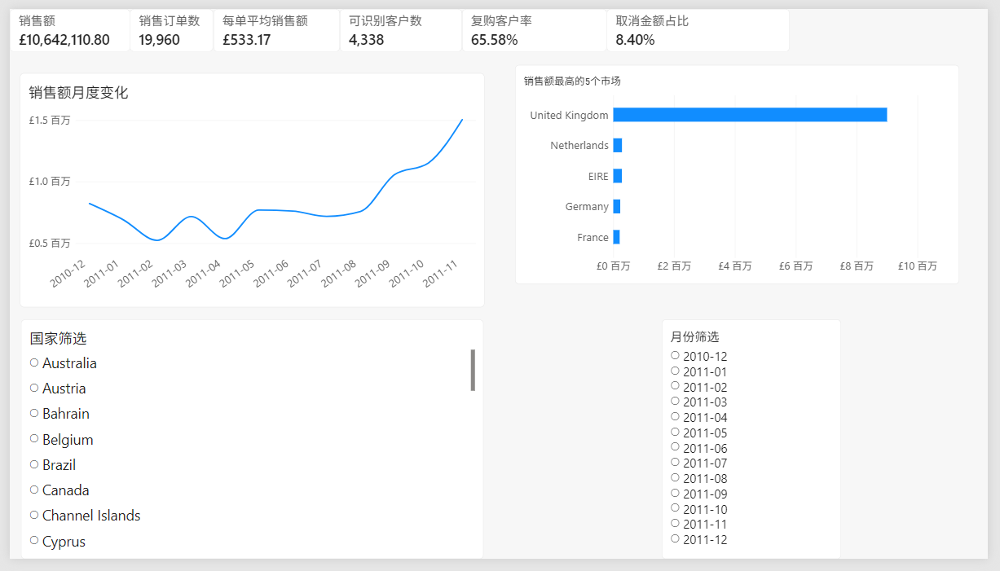
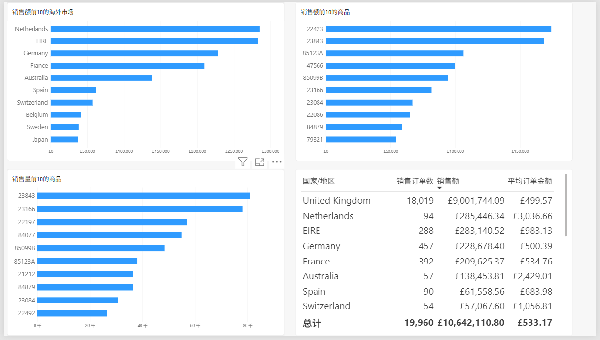
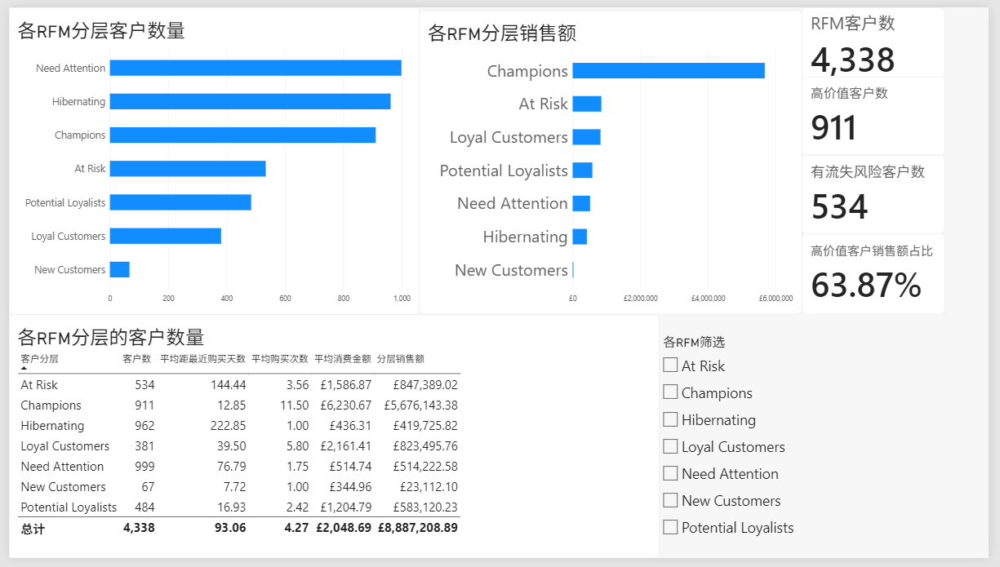

# Ecommerce Customer Analysis

基于公开电商交易数据的经营分析与客户价值分层项目。

> 当前状态：已完成数据清洗、SQL与Python业务分析、RFM客户分层和Power BI可视化，项目主体已完成。

## 项目简介

本项目模拟电商企业经营分析场景，使用Python、MySQL和Power BI完成数据清洗、业务指标分析、客户价值分层及可视化展示。

项目将重点分析销售趋势、国家和地区表现、商品表现、退款情况、客户复购情况，以及不同客户群体的价值差异。

## 计划回答的问题

1. 销售额、订单量和客户数如何随时间变化？
2. 哪些国家或地区贡献了主要销售额？
3. 哪些商品的销量和销售额较高？
4. 退款金额和退款率如何变化？
5. 客户复购情况如何？
6. 如何通过RFM模型进行客户价值分层？

## 阶段性分析结果

- 正常销售额为£10,642,110.80，共包含19,960个去重销售订单。
- 英国贡献84.59%的正常销售额，是最主要的销售市场。
- 4,338名可识别客户中，复购客户占65.58%。
- 取消金额为£893,979.73，占正常销售额的8.40%。
- 2011年11月是销售额最高的完整月份。
- Python复算的8项核心指标与SQL结果全部一致。
- 已生成月度销售趋势、海外市场和商品表现图表。
- 详细结果见[SQL业务分析报告](docs/sql_analysis.md)和[Python业务分析报告](docs/python_analysis.md)。
- RFM分析将4,338名可识别客户划分为7个客户群体。
- Champions占客户数的21.00%，贡献63.87%的可识别客户销售额。
- At Risk客户贡献9.53%的销售额，是重要的客户召回群体。
- 详细结果见[RFM客户价值分析报告](docs/rfm_analysis.md)。
- Power BI复现了全部核心指标，并构建经营总览、市场与商品、客户分层三个交互式页面。
- 详细设计与结果见[Power BI仪表盘说明](docs/power_bi_dashboard.md)。

## Power BI仪表盘

### 经营总览



### 市场与商品



### 客户分层



- [下载Power BI源文件](powerbi/ecommerce_customer_analysis.pbix)
- [查看仪表盘说明](docs/power_bi_dashboard.md)
- [查看DAX定义](powerbi/measures.dax)

## 技术工具

- Python
- pandas
- Jupyter Notebook
- MySQL
- Power BI
- Git与GitHub
- Visual Studio Code
- Matplotlib

## 当前项目结构

```text
ecommerce-customer-analysis/
├── data/
│   ├── raw/
│   │   └── README.md
│   └── processed/
│       ├── README.md
│       ├── customer_rfm.csv
│       └── transactions_clean_sample.csv
├── docs/
│   ├── data_audit.md
│   ├── data_cleaning.md
│   ├── data_dictionary.md
│   ├── environment_check.md
│   ├── metric_definitions.md
│   ├── power_bi_dashboard.md
│   ├── project_scope.md
│   ├── python_analysis.md
│   ├── rfm_analysis.md
│   └── sql_analysis.md
├── notebooks/
│   ├── 01_data_audit.ipynb
│   ├── 02_data_cleaning.ipynb
│   ├── 03_business_analysis.ipynb
│   └── 04_rfm_analysis.ipynb
├── powerbi/
│   ├── screenshots/
│   │   ├── 01_overview.png
│   │   ├── 02_market_product.png
│   │   └── 03_customer_rfm.png
│   ├── ecommerce_customer_analysis.pbix
│   └── measures.dax
├── reports/
│   └── figures/
│       ├── monthly_sales_trend.png
│       ├── rfm_segment_customers.png
│       ├── rfm_segment_sales.png
│       ├── top_overseas_markets.png
│       └── top_products_by_sales.png
├── sql/
│   ├── 01_create_schema.sql
│   ├── 02_import_transactions.sql
│   ├── 03_overview_metrics.sql
│   └── 04_business_analysis.sql
├── .gitignore
├── README.md
└── requirements.txt
```

## 数据来源

项目计划使用UCI Machine Learning Repository提供的Online Retail公开数据集：

https://archive.ics.uci.edu/dataset/352/online+retail

原始数据和完整清洗结果不上传GitHub。运行项目时，需要按照数据说明下载原始文件，并通过Notebook重新生成清洗结果。

## 项目进度

- [x] 明确项目范围
- [x] 安装并验收开发环境
- [x] 建立GitHub仓库
- [x] 下载并理解数据
- [x] 数据质量检查
- [x] 数据清洗
- [x] 建立业务指标口径
- [x] MySQL建库和数据导入
- [x] SQL业务分析
- [x] Python业务分析
- [x] RFM客户分层
- [x] Power BI仪表盘
- [x] 项目报告与最终文档

## 作者

GitHub：WhiterHJ