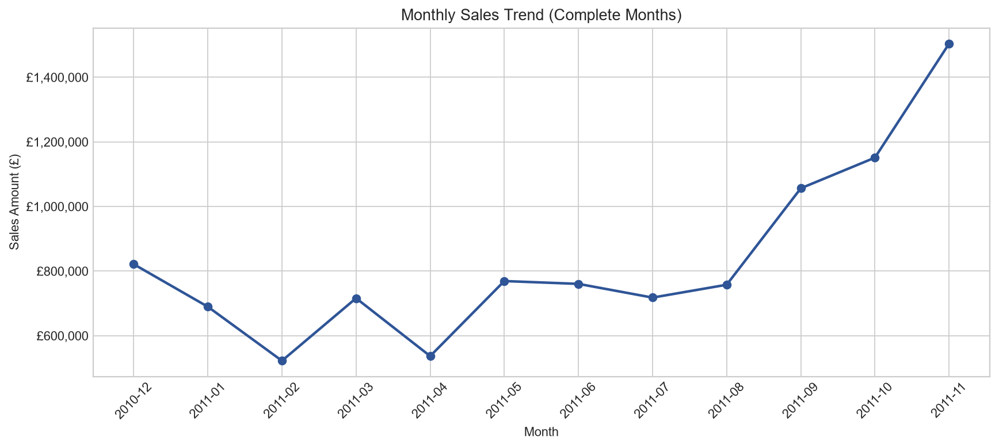
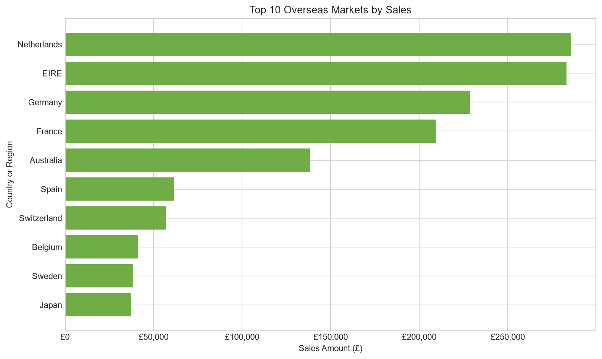
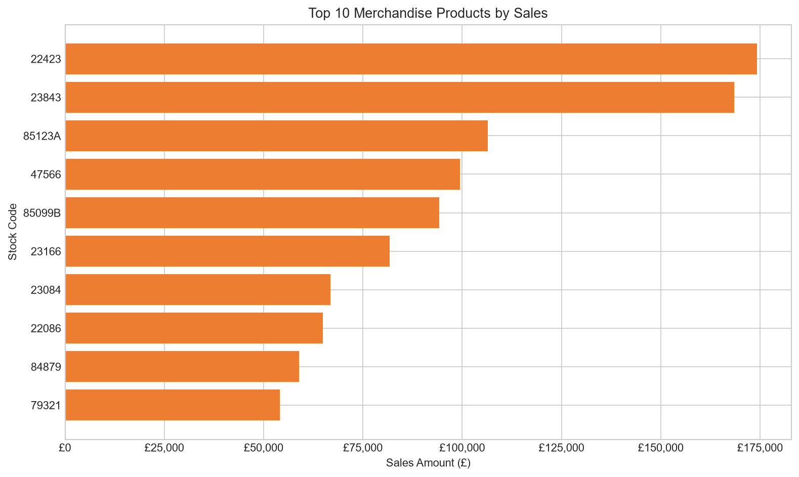

# Python业务分析结果

## 一、分析目的

本阶段使用pandas复算SQL阶段的核心经营指标，并使用Matplotlib生成业务分析图表。

主要目标包括：

1. 验证Python和MySQL的计算口径是否一致。
2. 展示月度销售额变化。
3. 比较主要海外市场。
4. 展示销售额最高的普通商品。
5. 为后续RFM客户价值分析准备Python分析环境。

完整代码见[Python业务分析Notebook](../notebooks/03_business_analysis.ipynb)，SQL阶段结果见[SQL业务分析报告](sql_analysis.md)。

## 二、分析范围

Python分析继续采用项目统一的业务口径：

- 正常销售记录：`TransactionType == "Sale"`
- 订单量：去重后的`InvoiceNo`
- 客户分析：仅包含具有`CustomerID`的正常销售记录
- 商品分析：仅包含`ItemType == "Merchandise"`的正常销售记录
- 2011年12月只有9天数据，不参与完整月份的环比分析
- 金额统一保留两位小数

## 三、Python与SQL结果验证

| 指标 | Python结果 | SQL结果 | 是否一致 |
|---|---:|---:|---|
| 正常销售明细数 | 524,878 | 524,878 | 是 |
| 正常销售订单量 | 19,960 | 19,960 | 是 |
| 可识别销售客户数 | 4,338 | 4,338 | 是 |
| 正常销售额 | £10,642,110.80 | £10,642,110.80 | 是 |
| 平均订单金额 | £533.17 | £533.17 | 是 |
| 可识别客户销售额 | £8,887,208.89 | £8,887,208.89 | 是 |
| 取消金额 | £893,979.73 | £893,979.73 | 是 |
| 复购客户占比 | 65.58% | 65.58% | 是 |

8项核心指标的差异均为0，说明Python与SQL使用了相同的数据范围和业务口径。

这种交叉验证可以降低单一工具中筛选条件、去重方式或金额计算错误未被发现的风险。

## 四、月度销售趋势

完整月份的销售额呈现明显波动：

- 2011年1月和2月销售额连续下降。
- 2011年3月恢复增长，4月再次回落。
- 2011年5月至8月销售额相对稳定。
- 2011年9月开始明显增长。
- 2011年11月销售额达到£1,503,866.78，是销售额最高的完整月份。

2011年下半年的增长可能受到年末节日销售影响，但数据只包含一个完整年度，不能据此确认长期季节性规律。

## 五、海外市场表现

排除英国后，销售额最高的海外市场主要包括：

1. Netherlands
2. EIRE
3. Germany
4. France
5. Australia

荷兰和爱尔兰的销售额接近，明显高于其他海外市场。

部分国家订单量不高，但平均订单金额较高，说明海外市场中可能存在批发型或大额采购客户。销售额排名不能单独代表客户规模，还需要结合订单量和平均订单金额分析。

## 六、商品销售表现

商品编号`22423`的正常销售额最高，其次是`23843`和`85123A`。

其中，`23843`的80,995件销量只来自一个订单。这笔大额交易明显影响了商品排名，因此不能直接将其解释为大量消费者共同形成的畅销需求。

商品分析以`StockCode`作为主要标识，商品描述只用于辅助展示，避免描述文字差异造成重复分组。

## 七、Python分析方法

本阶段使用了以下主要方法：

- `read_csv()`读取清洗后的完整数据。
- 使用布尔条件筛选正常销售、取消交易和普通商品。
- 使用`groupby()`按照月份、国家、商品和客户聚合。
- 使用`nunique()`计算去重订单量和客户数。
- 使用`pct_change()`计算完整月份的环比变化。
- 使用`nlargest()`提取销售额最高的市场和商品。
- 使用`assert`自动验证数据规模、指标结果和图表文件。
- 使用Matplotlib生成折线图和横向柱状图。

## 八、主要结论

1. Python复算结果与SQL完全一致，统一业务指标口径得到验证。
2. 2011年9月至11月销售额明显增长，11月达到最高点。
3. 英国以外的主要市场是荷兰、爱尔兰、德国、法国和澳大利亚。
4. 海外市场表现需要结合销售额、订单量和平均订单金额判断。
5. 个别商品排名受到单笔大额订单影响，需要谨慎解释。
6. 当前Python分析流程已经可以继续支持RFM客户价值分析。

## 九、分析限制

- 2011年12月只有9天数据，未纳入完整月份趋势比较。
- 客户分析无法覆盖缺少`CustomerID`的记录。
- 数据没有成本和利润字段，因此不能进行利润分析。
- 取消记录不能直接解释为已完成退款。
- 数据只来自一家英国零售企业，结论不代表整个电商行业。
- 当前时间跨度不足以验证长期季节性变化。