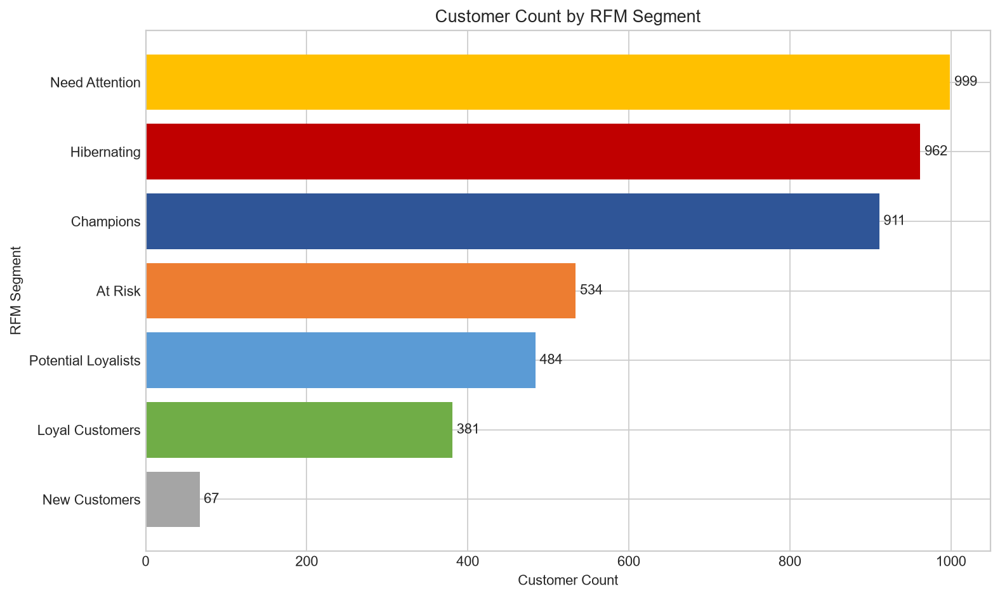
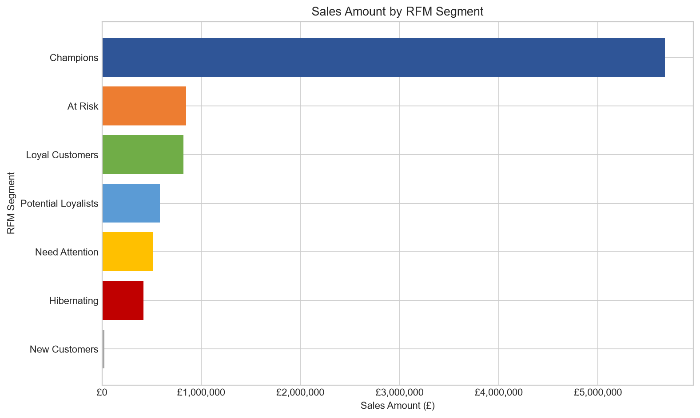

# RFM客户价值分层结果

## 一、分析目的

本阶段使用RFM模型对可识别客户进行价值分层，分析不同客户群体的活跃程度、购买频率和销售额贡献，为客户维护、复购促进和流失召回提供依据。

完整计算过程见[RFM分析Notebook](../notebooks/04_rfm_analysis.ipynb)，客户级结果见[customer_rfm.csv](../data/processed/customer_rfm.csv)。

## 二、分析范围

RFM分析使用具有客户编号的正常销售记录：

- 客户数量：4,338名
- 客户销售明细：392,692行
- 客户销售订单：18,532单
- 客户销售额：£8,887,208.89
- 分析日期：2011-12-10
- 客户编号缺失记录不参与分析
- 取消交易不计入RFM销售额

分析日期采用数据中最后交易日期的下一天，使最近一次购买发生在数据结束日的客户获得1天的Recency。

## 三、RFM指标定义

### Recency

表示客户距离最近一次购买过去的天数。

计算方式：

```text
Recency = 分析日期 - 最近一次购买日期
```

Recency越小，表示客户近期越活跃。

### Frequency

表示客户产生的去重正常销售订单数量。

```text
Frequency = COUNT(DISTINCT InvoiceNo)
```

Frequency越大，表示客户购买频率越高。

### Monetary

表示客户累计贡献的正常销售额。

```text
Monetary = SUM(LineAmount)
```

Monetary越大，表示客户历史销售额贡献越高。

该指标表示正常销售金额，不等于净收入或利润。

## 四、评分方法

R、F、M分别使用1至5分评分。

- Recency越小，R分越高。
- Frequency越大，F分越高。
- Monetary越大，M分越高。
- 相同原始数值获得相同评分。
- RFM总分为R、F、M三项分数之和。
- RFM组合分数由三项分数连接组成，例如`555`。

评分基于当前客户群体中的百分位排名，因此属于相对评分。数据更新后，客户评分和分群结果可能随整体客户分布发生变化。

## 五、客户分群规则

| 客户群体 | 主要特征 | 业务含义 |
|---|---|---|
| Champions | R、F、M均较高 | 近期活跃、购买频繁且销售额贡献高 |
| Loyal Customers | 近期仍有购买且频率较高 | 具有稳定购买行为的忠诚客户 |
| Potential Loyalists | 近期活跃，购买次数处于成长阶段 | 具有进一步培养潜力 |
| New Customers | 最近购买但只有一个订单 | 刚完成首次购买 |
| Need Attention | 活跃度、频率或贡献处于中间水平 | 需要进一步观察和激活 |
| At Risk | 历史频率和贡献较高，但近期不活跃 | 存在流失风险 |
| Hibernating | 长期未购买且历史频率较低 | 处于沉睡状态 |

分群条件按优先顺序执行，避免同一客户同时进入多个群体。

## 六、分群结果

| 客户群体 | 客户数 | 平均Recency | 平均Frequency | 平均Monetary | 销售额 | 客户占比 | 销售额占比 |
|---|---:|---:|---:|---:|---:|---:|---:|
| Champions | 911 | 12.85 | 11.50 | £6,230.67 | £5,676,143.38 | 21.00% | 63.87% |
| At Risk | 534 | 144.44 | 3.56 | £1,586.87 | £847,389.02 | 12.31% | 9.53% |
| Loyal Customers | 381 | 39.50 | 5.80 | £2,161.41 | £823,495.76 | 8.78% | 9.27% |
| Potential Loyalists | 484 | 16.93 | 2.42 | £1,204.79 | £583,120.23 | 11.16% | 6.56% |
| Need Attention | 999 | 76.79 | 1.75 | £514.74 | £514,222.58 | 23.03% | 5.79% |
| Hibernating | 962 | 222.85 | 1.00 | £436.31 | £419,725.82 | 22.18% | 4.72% |
| New Customers | 67 | 7.72 | 1.00 | £344.96 | £23,112.10 | 1.54% | 0.26% |

各群体客户数合计4,338名，销售额占比合计100%。

## 七、客户数量分布



客户数量最多的是Need Attention，共999名，占23.03%。

Hibernating客户有962名，占22.18%。这部分客户长期未购买，且历史购买频率较低。是否值得召回，需要结合营销成本判断。

Champions有911名，占全部可识别客户的21.00%。

## 八、客户销售额贡献



Champions贡献£5,676,143.38，占可识别客户销售额的63.87%。该群体仅占客户总数的21.00%，但贡献接近三分之二的客户销售额，是最重要的客户群体。

At Risk客户贡献9.53%的销售额。虽然这些客户近期活跃度较低，但历史购买频率和金额较高，因此具有较高的召回价值。

Loyal Customers贡献9.27%的销售额，是适合开展会员维护、关联销售和忠诚度提升的客户群体。

## 九、客户运营建议

### Champions

- 提供会员权益、提前购和专属服务。
- 避免使用过度折扣损害已有销售额。
- 关注服务体验和客户流失信号。

### Loyal Customers

- 推荐相关商品和组合商品。
- 通过会员积分鼓励持续购买。
- 识别可能成长为Champions的客户。

### Potential Loyalists

- 设计第二次或第三次购买激励。
- 根据近期购买商品进行定向推荐。
- 重点提高购买频率。

### New Customers

- 提供购买后的欢迎信息和使用指导。
- 设计首次复购优惠。
- 观察是否能转化为Potential Loyalists。

### At Risk

- 优先进行客户召回。
- 分析客户曾经购买的商品和最后购买时间。
- 使用有期限的召回优惠，但应控制营销成本。

### Need Attention

- 根据历史商品偏好进行分组营销。
- 测试不同召回内容。
- 避免对全部客户采用相同促销方式。

### Hibernating

- 优先使用成本较低的批量召回活动。
- 对长期无响应客户降低营销频率。
- 在制定投入前评估其历史客户价值。

这些建议来自RFM行为特征，并不表示营销活动一定会产生相应结果。实际效果仍需通过活动数据验证。

## 十、主要结论

1. Champions只占客户数的21.00%，但贡献63.87%的可识别客户销售额。
2. 客户价值高度集中在近期活跃、购买频繁且贡献较高的核心客户中。
3. At Risk客户贡献9.53%的销售额，是优先召回对象。
4. Loyal Customers和Potential Loyalists适合通过会员维护和复购激励提升价值。
5. Need Attention和Hibernating合计占45.21%的客户，需要根据历史价值控制召回成本。
6. New Customers目前数量较少，适合通过购买后运营促进第二次购买。

## 十一、分析限制

- 缺少客户编号的销售记录没有参与RFM分析。
- Monetary只统计正常销售额，没有扣除取消交易。
- 数据没有利润、营销成本和客户联系方式。
- RFM只能反映历史交易行为，不能直接解释行为原因。
- 分群规则是本项目制定的业务规则，不是唯一标准。
- 百分位评分属于相对评分，数据更新后分数可能改变。
- 个别大额订单可能影响客户销售额及群体平均值。
- 当前数据无法验证营销建议的实际效果。